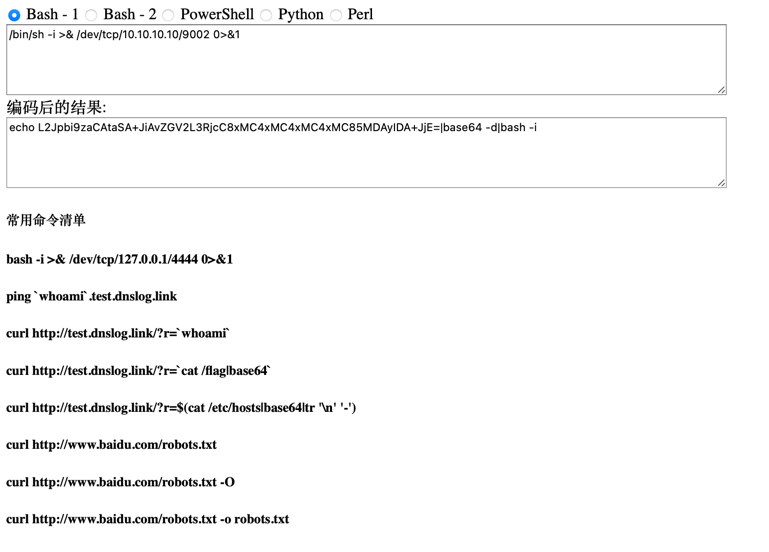
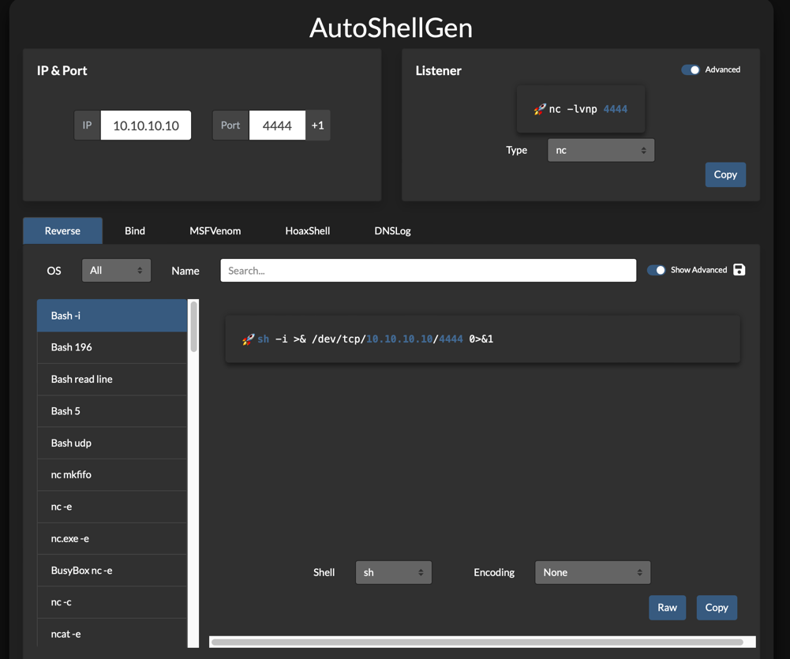
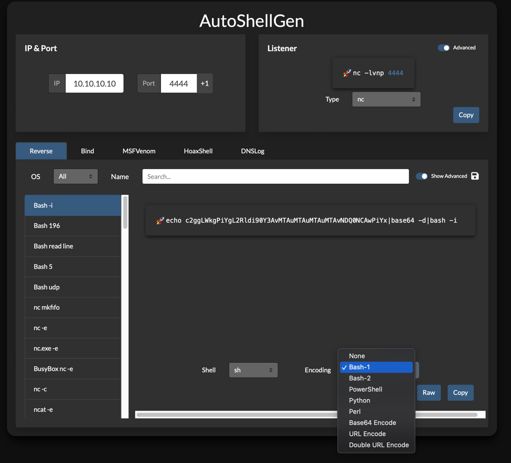
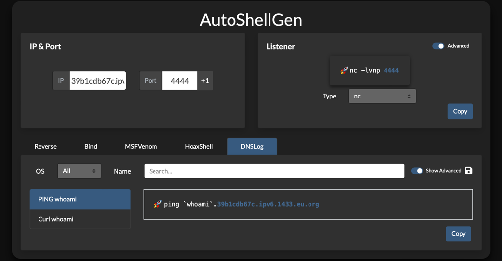

# AutoShellGen

Automated Reverse Shell Command Generator by IP and Port.

## Features

A versatile tool that streamlines the generation of common listeners and reverse shells, offering features such as a save button for easy payload downloads, URI and Base64 encoding options, and the ability to increment listening ports with a single click.

## Roadmap

- [ ] Add Log4j2 test payloads

## Get Started

Open index.html Using a Local Browser

## HoaxShell Listener Docs

[https://github.com/t3l3machus/hoaxshell/tree/main/revshells](https://github.com/t3l3machus/hoaxshell/tree/main/revshells)

## Old Version Tools

## New Version Tools
* Automated Reverse Shell Command Generation and Server Listening Setup

* Base64 Encoding of Commands for Cross-Environment Execution

* Command Execution Through DNSLog Data Exfiltration

